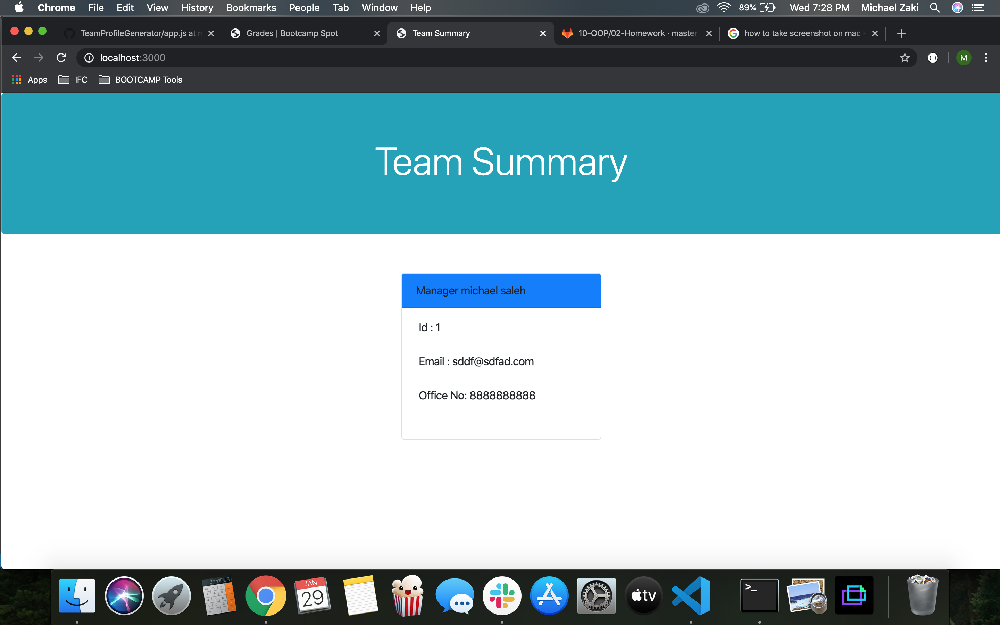

# hw10-templateEngine
The application will prompt the user for information about the team manager and then information about the team members. The user can input any number of team members, and they may be a mix of engineers and interns. When the user has completed building the team, the application will create an HTML file that displays a nicely formatted team roster based on the information provided by the user.

i googled ways to display CLI apps on HTML and i used Handlebars.

test demo

App Demo

HTML Demo
